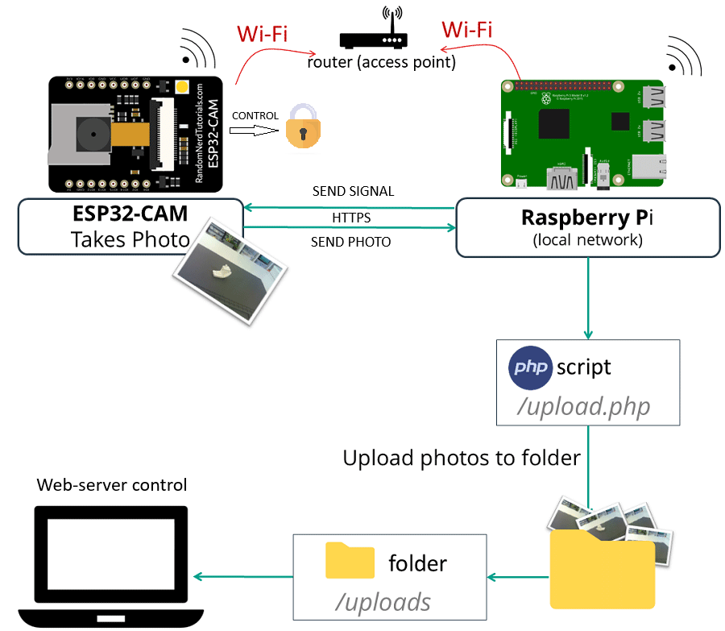

# FACE RECOGNITION DOOR LOCK [WEBSOCKET]

### Purpose:

- Using camera and recognize face to open door lock.
- Using website to control the door lock.

## 1. Hardware:

- Raspberry Pi 4B.
- Webcam or Raspberry Pi Camera module.

## 2. Program:

- Python 3.7+ on Raspberry Pi OS.
- Using Raspberry as a LAMP/LEMP server or using Flask to create a web server.

## 3. Scheme:

# Contributors:

- [Lê Ngọc Thao - 2114758](https://github.com/thaole04)
- [Trương Tân](https://github.com/MrT203)
